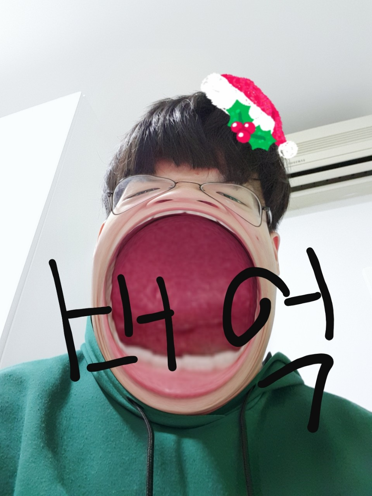

# ACPU1
<html>
<head>
  <title>동키동키 신동훈</title>
</head>

<body>
<h1><strong>신동훈(a.k.a. <u><a href="https://namu.wiki/w/%EB%8B%B9%EB%82%98%EA%B7%80" target="_blank">동키)</a></u>에 대하여</strong></h1>

  기원전 500년, 이 세상에는 당나귀 한 마리가 있었다. 말 그대로 그냥 존재하고 있었다. 그러나 어느 날 이 당나귀는 아주 대담하고 건방진 생각을 했는데, 그는
  인간이 되고 싶었던 것이다. 하지만 주위에 그 어떤 것도 존재하지 않던 흑암 속에서 당나귀는 정처 없이 떠돌 뿐이었다. 좌절에 빠져 있을 때 갑자기 목소리가 들렸다, "나귀야"
  당나귀는 소스라치게 놀라며 되물었다. "뉘신지?" 목소리가 대답했다, "나는 이 세상의 창조자 영운신이다. 내 너를 불쌍히 여겨 인간으로 만들어 주기로 했다. 지금부터
  100일간 동굴에서 당근만 먹고 지내거라." 인간이 너무 되고 싶었던 당나귀는 그렇게 100일동안 동굴에서 고달프게 당근만 먹고 사람이 되었다. 이 고생에 대한 보답으로
  영운신은 그에게 '신동훈'이라는 이름을 지어주었고, 그렇게 당나귀는 '신동훈'이 됐다.

<ul>
  <li>출생: 2003년 6월 20일 (17살)</li>
  <li>국적: <a href="https://en.wikipedia.org/wiki/Korea" target="_blank">대한민국</a></li>
  <li>신체: 174cm</li>
  <li>꿈: 프로그래머</li>
  <li>취미: 축구</li>
   
  <li>좋아하는 음식: 햄버거</li>
  <li>좋아하는 색깔: 흰색</li>
  <li>좋아하는 노래: 발라드</li>
  <li>너에 대한 한줄평: 열정적으로 활동한다</li>
  <h3>좋아하는 동물: 당나귀</h3>
  
  

</ul>
<ol>버킷리스트
  <li>유럽 여행</li>
  <li>미국 여행</li>
  <li>대학 잘가기</li>
  <li>좋은 회사 취직하기</li>
  <li>결혼하기</li>

</body>

</html>
